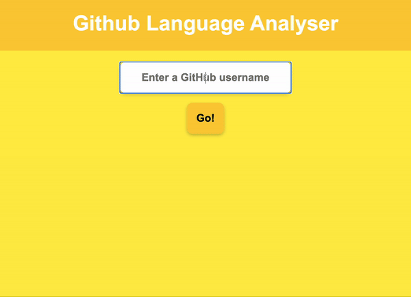
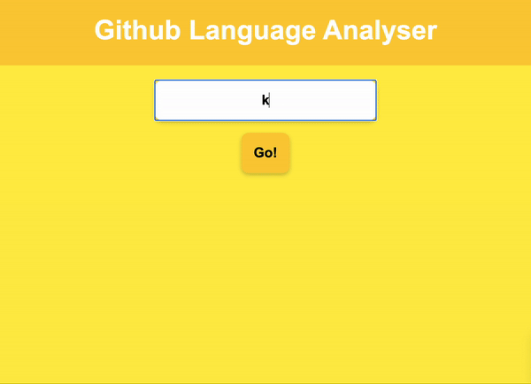
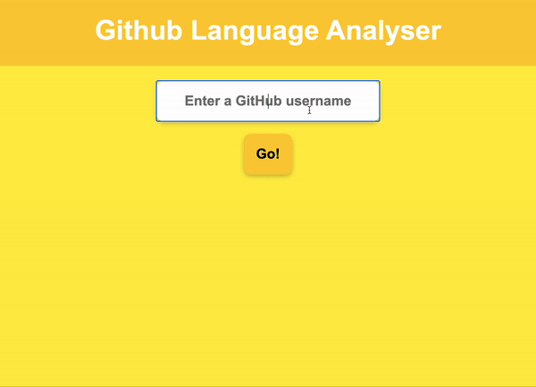

# GitHub Favourite Languages

[](https://travis-ci.com/AJ8GH/github-language-api)
[](https://codecov.io/gh/AJ8GH/github-language-api)
[](https://bettercodehub.com/results/AJ8GH/github-language-api)
[](https://codeclimate.com/github/AJ8GH/github-language-api/maintainability)
[](https://standardjs.com)
 <a href="https://standardjs.com" style="float: right; padding: 0 0 20px 20px;"></a>

App to determine the favourite proramming languages of a GitHub user, using the public GitHub API

[Deployed App](#deployed-app) | [Getting Started](#getting-started) | [Running Tests](#running-tests) | [Usage](#using-the-app) | [Dependencies](#dependencies) | [User Stories](https://github.com/AJ8GH/github-language-api/blob/main/user-stories.md)

## Deployed app

You can use the deployed application [here](https://github-language-analyser.herokuapp.com/)

## Using the app

Open the [app](https://github-language-analyser.herokuapp.com/) and enter the username of any GitHub user. Click "Go!" to see the results. You will be notified if you forget to enter a username, if the user doesn't exist, or if they have not committed any code to their GitHub. Repeat as many times as you like!



## Getting started

Clone this repository:

```shell
git@github.com:AJ8GH/github-language-api.git
```

Navigate to the root of the project and install the development dependencies:

```shell
cd github-language-api
npm i
```

To run the app locally, start the server:

```shell
npm start
```

Then head to localhost in your browser at port 3000, or [click here](http://localhost:3000/)

## Running tests

The app uses Mocha for unit tests and Cypress for integration tests.

### Mocha

Unit tests can be run from the project root with:

```shell
npm test
```

You will need to ensure the server is not running locally when running the Mocha test suite or you will get an error, since mocha also runs the `app.test.js` file, which tests the connection to the server.

### Cypress

To run the Cypress test suite, first start the server:

```shell
npm start
```

Then, with the server still running:

```shell
npm run cy
```

## Design

I chose to built this app using Node.js for the backend and 'vanilla' JS for the frontend UI. In designing and developing the app, I have applied the following techinques:

### TDD

* Followed an outside-in, red-green-refactor, tdd process
* Used `Cypress` for end-to-end BDD, and `Mocha` for testing the server and the `Deserializer` class
* Used `c8`, `nyc` and CodeCov to track test coverage
* Mocked calls to the GitHub API in the tests, using Cypress' `cy.intercept` method

### CI/CD

* Set up CI/CD using travis, which runs all unit and feature tests
* On a successful build, travis submits test coverage data to CodeCov and deploys the new version to Heroku

### Code Quality

* Used TDD and OOP principles to ensure my code stayed readable and maintainable
* Applied the Single Responsibility Principle in keeping classes and functions short and with a clear purpose
* Created the `Deserializer` class, responsible for manipulating the raw JSON data from the GitHub API, in order to separate the logic involved in this process, from the JavaScript code in `interface.js`. The Interface code is responsible for manipulating the DOM
* Created the `GitHubApiClient` class, responsible for making HTTP calls to the GitHub API
* Tracked code quality using CodeClimate and Better Code Hub
* Used ESLint to ensure consistent style and ensure there were no syntax errors
* Stored message string constants in a `translations/enGB.js` file, further separating concerns, and allowing for scalability

### Workflow and process

* Wrote [user stories](https://github.com/AJ8GH/github-language-api/blob/main/user-stories.md) to define a clear set of features and problems to solve
* Made regular, atomic git commits, on green and refactor stages of my TDD process
* Used clear commit messages for easy use of the git log

### Edge cases

I tested and handled the following edge cases, for a smooth user experience:
* Users with Null language repositories

```js
// Deserializer.js
_filterNulls (languages) {
  return languages.filter(language => language !== null)
}
```

* Empty username input


* Invalid username input



* Users with no repositories



## Dependencies

* `"c8": "^7.7.2"`
* `"chai": "^4.3.4"`
* `"chai-http": "^4.3.0"`
* `"cypress": "^7.4.0"`
* `"eslint": "^7.28.0"`
* `"eslint-config-standard": "^16.0.3"`
* `"eslint-plugin-cypress": "^2.11.3"`
* `"eslint-plugin-import": "^2.23.4"`
* `"eslint-plugin-node": "^11.1.0"`
* `"eslint-plugin-promise": "^5.1.0"`
* `"express": "^4.17.1"`
* `"mocha": "^8.4.0"`
* `"nyc": "^15.1.0"`
* `"wait-on": "^5.3.0"`
